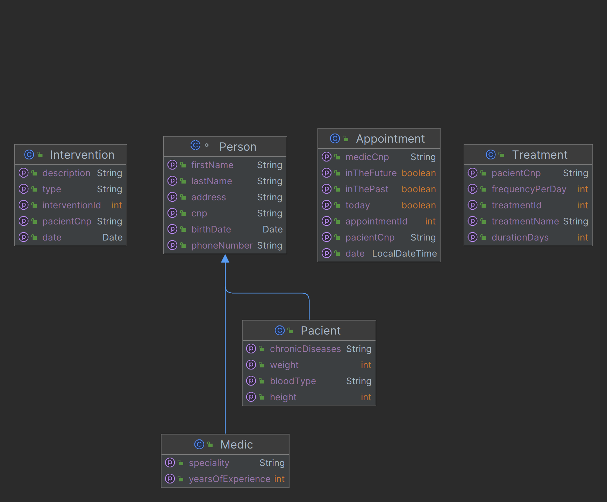
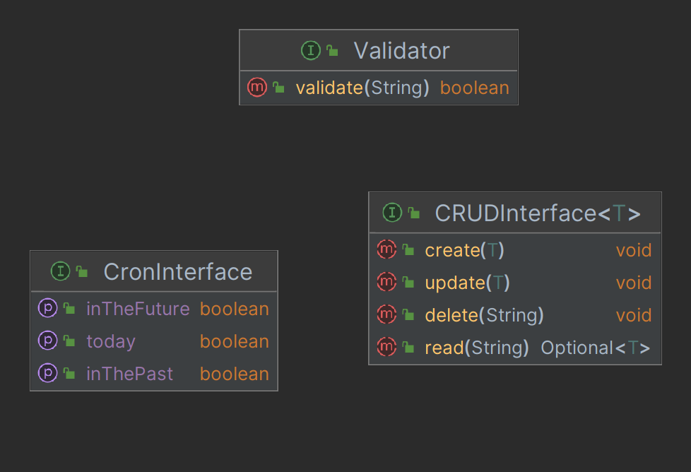
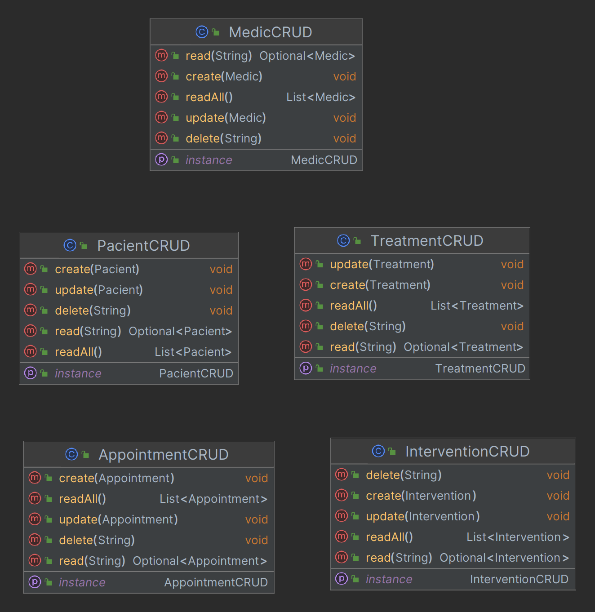
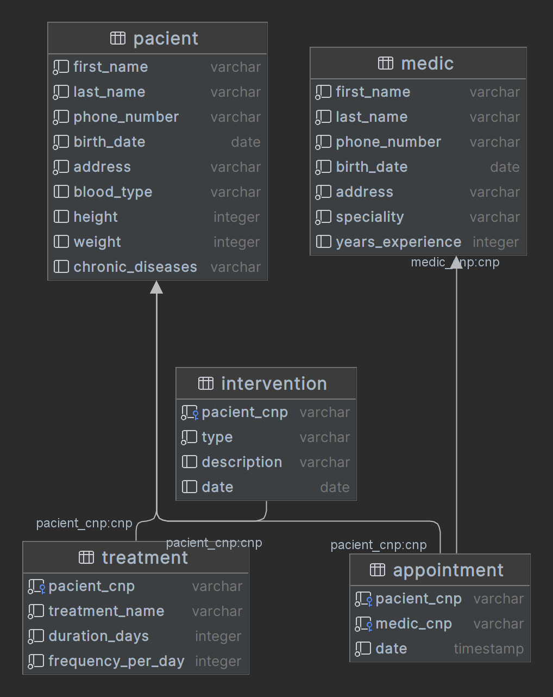
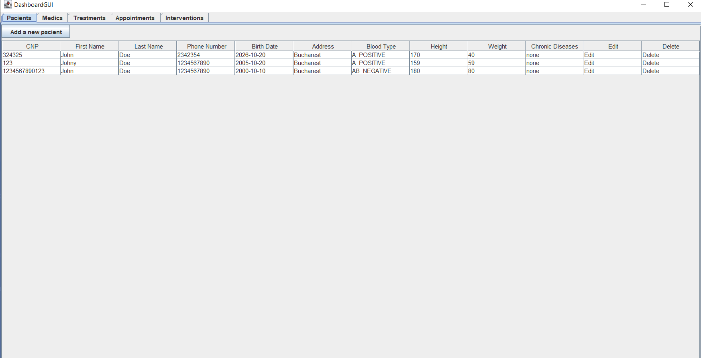
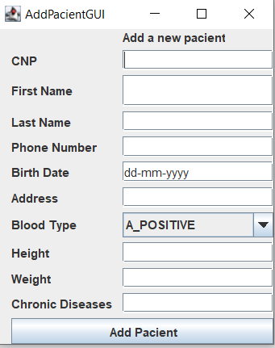
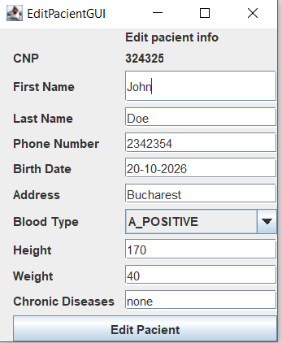
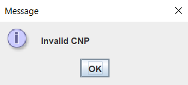
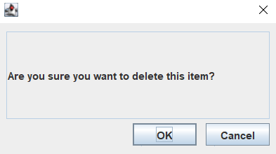

# JavaMed - Medical Clinic Administration App 🩺

JavaMed is a comprehensive administration app designed to streamline the operations of a medical clinic. Developed using Java and Object-Oriented Programming (OOP) principles, this app provides a robust platform for managing various clinic functionalities, including appointments, medics, patients, medications, and medical interventions. This document details the project's structure, features, design patterns, and more.

## Project Structure ⚙️

### 1. Models 📋
The `Models` package contains the primary entities of the application. Each entity represents a real-world object in the medical clinic environment. The main classes include:
- **Medic**: Represents a doctor with attributes like name, specialization, and contact information.
- **Pacient (Patient)**: Represents a patient with attributes such as name, CNP (Personal Numeric Code), blood type, and contact details.
- **Appointment**: Represents a scheduled meeting between a patient and a medic.
- **Medication**: Represents drugs prescribed to patients.
- **MedicalIntervention**: Represents procedures or treatments administered to patients.

### 2. Interfaces 🔌
Interfaces in this application define the structure for Validators and CRUD (Create, Read, Update, Delete) operations. By using interfaces, we ensure that different parts of the application adhere to a consistent contract, making the code more modular and easier to maintain.
- **Validator Interface**: Defines methods for validating various data attributes.
- **CRUD Interface**: Defines standard operations for managing database entities.

### 3. Enums 🔢
Enums are used to define a set of constants for specific attributes, providing better type safety and readability.
- **BloodType**: Enum for storing different blood types (e.g., A_POSITIVE, B_NEGATIVE).
- **Specialization**: Enum for storing different medical specializations (e.g., CARDIOLOGY, ORTHOPEDICS).

### 4. Validators ✅
Validator classes implement the `Validator` interface to ensure data integrity and validity. These classes are essential for checking that inputs such as CNP and phone numbers meet predefined criteria.
- **CNPValidator**: Validates the format and uniqueness of a patient's CNP.
- **PhoneNumberValidator**: Ensures phone numbers adhere to a specific format and are valid.

### 5. Utils 🛠️
Utility classes provide auxiliary functions that support the main application logic.
- **DBConnection**: Manages the connection to the PostgreSQL database, ensuring efficient and secure database operations.
- **Logger**: A class dedicated to logging operations, recording all significant events and actions performed within the application.

### 6. Custom Exceptions 🚫
Custom exceptions enhance error handling by providing specific feedback when invalid data is encountered. Examples include:
- **InvalidCNPException**: Thrown when a patient's CNP is not valid.
- **InvalidPhoneNumberException**: Thrown when a phone number does not meet the required format.

### 7. GUI 🖥️
The `GUI` package encompasses all the graphical user interface components, built using JavaSwing. These components provide a user-friendly way to interact with the app.
- **Dashboard**: The main interface that provides an overview and access to various functionalities.
- **Add Item Form**: Form for adding new patients, medics, appointments, etc.
- **Edit Item Form**: Form for editing existing records.
- **Validators**: Interface elements that validate user input in real-time.
- **Delete Prompt**: Confirmation dialog for deleting records.

### 8. CRUD 🗄️
Service classes in the `CRUD` package perform operations for creating, reading, updating, and deleting database records. Each service class corresponds to an entity in the `Models` package and uses the DAO (Data Access Object) pattern to interact with the database.

## UML Schemas 📊

### Models
The UML diagram for models provides a visual representation of the entities and their relationships.

### Interfaces
The UML diagram for interfaces shows the structure and relationships between different interfaces and their implementations.

### CRUD Service Classes
The UML diagram for CRUD service classes illustrates how these classes interact with the database and other parts of the application.

## Database 🗃️

The application uses PostgreSQL as its database management system, chosen for its robustness and scalability. The database schema is designed to efficiently store and manage data related to patients, medics, appointments, medications, and medical interventions.

## GUI 🖼️

The graphical user interface, developed using JavaSwing, is designed to be intuitive and user-friendly.

### Dashboard
The main dashboard provides an overview and access to the primary functions of the application.

### Adding a New Item ➕
A form that allows users to add new records, such as patients or appointments.

### Editing an Item ✏️
A form for modifying existing records.

### Validators ✔️
Interface elements that provide real-time validation feedback to ensure data integrity.

### Delete Prompt 🗑️
A confirmation dialog that appears when a user attempts to delete a record, ensuring intentional actions.

## Service Classes 🛠️

Service classes in the `CRUD` package handle all database operations, encapsulating the logic required to interact with the database. This modular approach ensures that data operations are centralized and easily maintainable.

## Design Patterns 🎨

The application employs several design patterns to ensure code quality and maintainability:
- **Singleton**: Ensures that only one instance of the `DBConnection` class exists, providing a global point of access to the database.
- **DAO (Data Access Object)**: Separates the data access logic from the business logic, making the code easier to manage and test.

## Custom Exceptions ⚠️

Custom exceptions provide specific and meaningful error messages, improving the robustness and user experience of the application. By handling exceptions related to invalid data (e.g., CNP, phone numbers), the application ensures high data integrity.

## OOP Principles 📐

JavaMed leverages core OOP principles to create a flexible and scalable codebase:
- **Inheritance**: The `Pacient` and `Medic` classes inherit from the `Person` class, promoting code reuse.
- **Collections**: Used to manage and display lists of items on the dashboard.
- **Enums**: Define fixed sets of constants for attributes like blood type and specializations.
- **Abstract Classes**: Abstract classes like `Person` and `Logger` provide a template for derived classes, ensuring consistent implementation.

## Logging 📜

The `Logger` class records all significant operations performed on the database, such as adding, updating, or deleting records. This logging mechanism is crucial for auditing, debugging, and tracking the application's usage. Logging is implemented by writing all the database operations to a text file.

## The Main Class 🚀

The `Main` class serves as the entry point of the application. It initializes the GUI and manages the overall behavior of the dashboard, ensuring that the application starts correctly and provides a seamless user experience.

## Conclusion 🎉

JavaMed is a well-architected administration app that leverages Java and OOP principles to provide a robust and user-friendly platform for managing medical clinic operations. With its modular design, comprehensive feature set, and adherence to design patterns, JavaMed is an excellent tool for enhancing the efficiency and effectiveness of clinic management. The application not only ensures high data integrity and robust error handling but also provides a scalable foundation that can be extended and maintained with ease.
